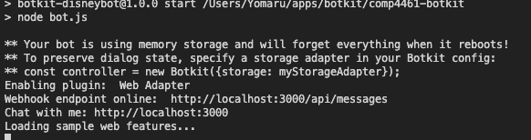

# Botkit Starter Kit

This is a Botkit starter kit for web, created with the [Yeoman generator](https://github.com/howdyai/botkit/tree/master/packages/generator-botkit#readme).

To complete the configuration of this bot, make sure to update the included `.env` file with your platform tokens and credentials.

[Botkit Docs](https://botkit.ai/docs/v4)

This bot is powered by [a folder full of modules](https://botkit.ai/docs/v4/core.html#organize-your-bot-code). 
Edit the samples, and add your own in the [features/](features/) folder.

# how to start 

1. install npm and [node](https://nodejs.org/en/)
2. open terminal 
3. run command `npm install -g yo generator-botkit`
4. make an empty directory and cd into directory 
5. run command `git clone https://github.com/HananoshikaYomaru/comp4461-botkit.git`
6. run command `npm install`
7. to start, run command `npm run start`, then server will be set up in `http://localhost:3000`

# how to update 
1. run command `git pull https://github.com/HananoshikaYomaru/comp4461-botkit.git master`